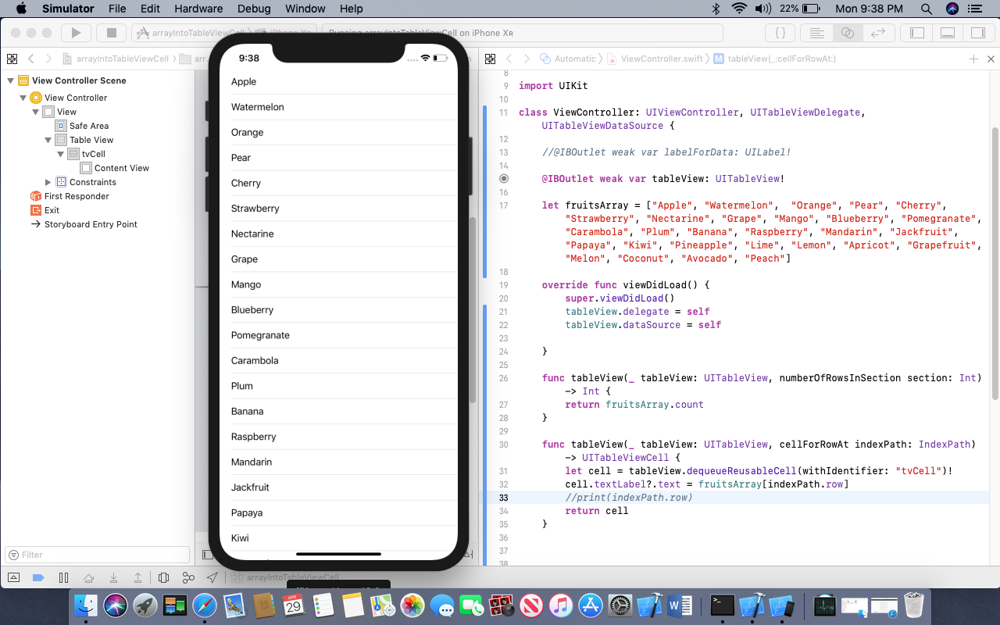
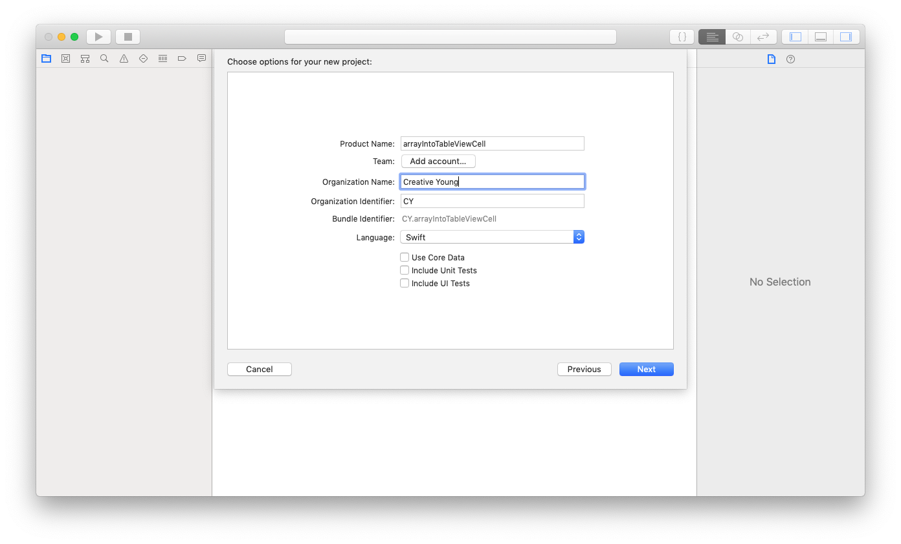
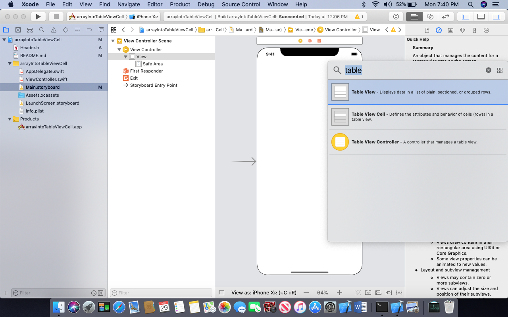
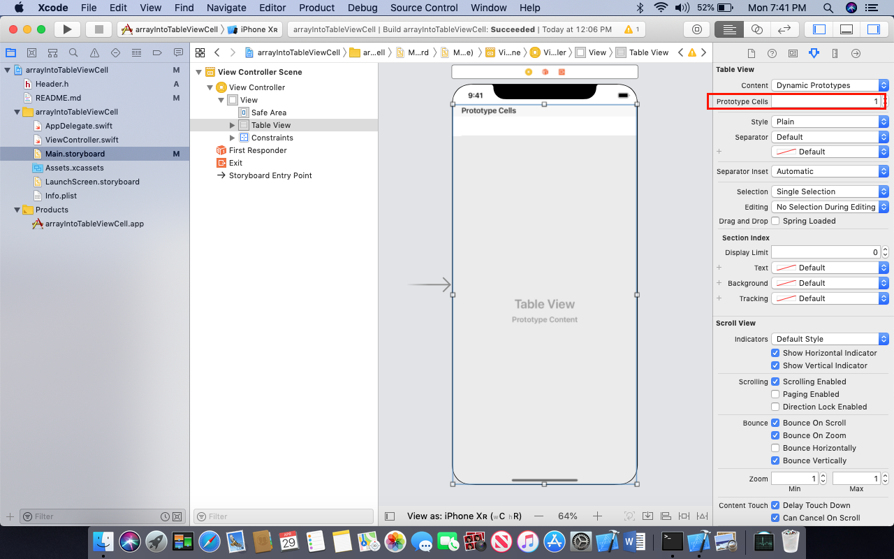
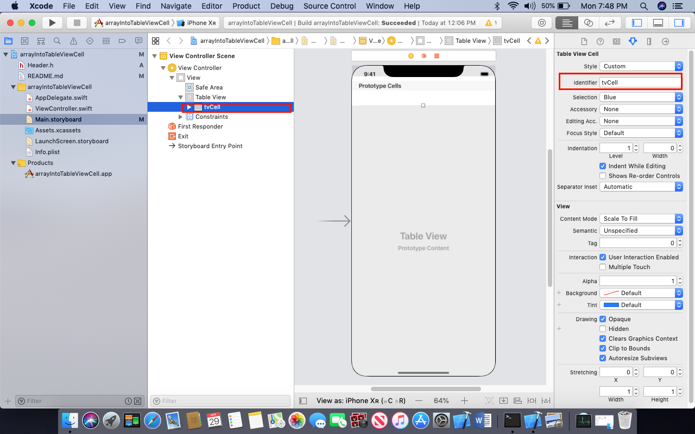
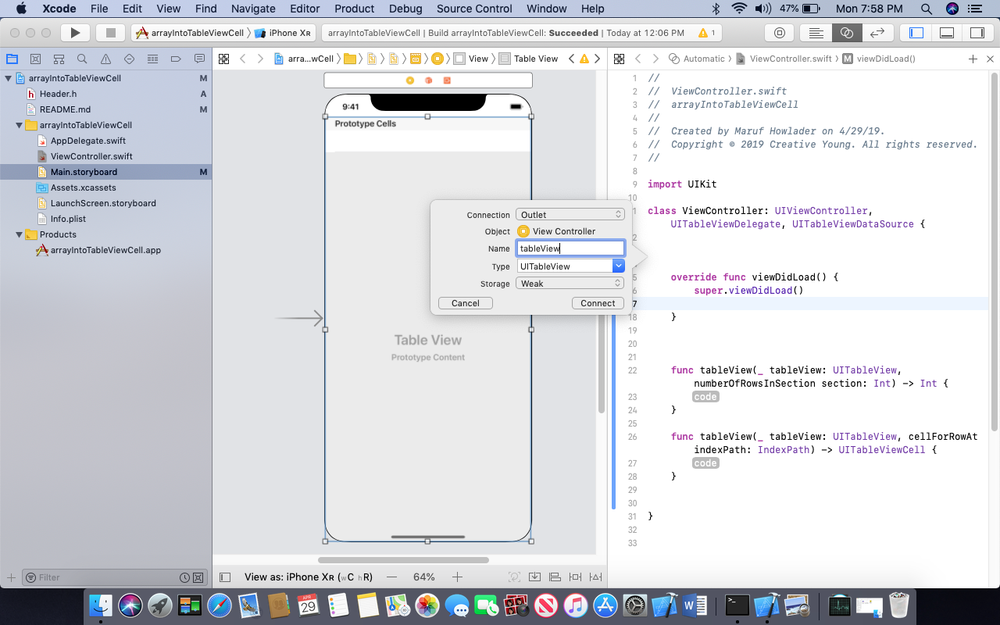

# Show array data into a tableView cell

## Our Goal

Its a simplest project to understand tableView Cell

## What you will create

We show data into a tableView Cell

## What you will learn

* Declearation a array and accessing its value using key randomly
* tableView Cell and Show Data into the cell


## Let's Learn

Create New Project


Drag and Drop a tableView into Storyboard


Add a single protype cell to the tableView from Attribute Inspector


Select the cell and named it tvCell througn Attribute Inspector



Inherite UITableViewDelegate, UITableViewDataSource super class to out ViewController to access data from UI tableView

Create an outlet of out tableView to ViewController


Initializ tableView Into Current ViewController default viewDidLoad function as Delegates and DastaSourec 
```swift
super.viewDidLoad()
tableView.delegate = self
tableView.dataSource = self
```
Finaly add two function of tableView to return all array data as value into  tableView Cell default Label text 

```swift
func tableView(_ tableView: UITableView, numberOfRowsInSection section: Int) -> Int {
return fruitsArray.count
}

func tableView(_ tableView: UITableView, cellForRowAt indexPath: IndexPath) -> UITableViewCell {
let cell = tableView.dequeueReusableCell(withIdentifier: "tvCell")!
cell.textLabel?.text = fruitsArray[indexPath.row]
//print(indexPath.row)
return cell
}
```
Run your project & you will get the result like this 


>Check out the full course and more at 

[www.joyonlineschool.com](https://www.joyonlineschool.com/)


