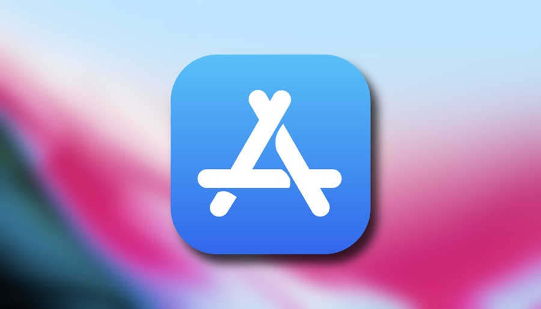

# Show Array Into tableView Cell

## Our Goal

Its a simplest project to understand tableView Cell

## What you will create

We show something into a tableView Cell

## What you will learn

* Declearation a array and accessing its value using key
* tableView Cell and Show Data into the cell


## Let's Learn

```swift

```

>This is a companion project to JOY Online School Complete App Developement Bootcamp, check out the full course at [www.joyonlineschool.com](https://www.joyonlineschool.com/)


